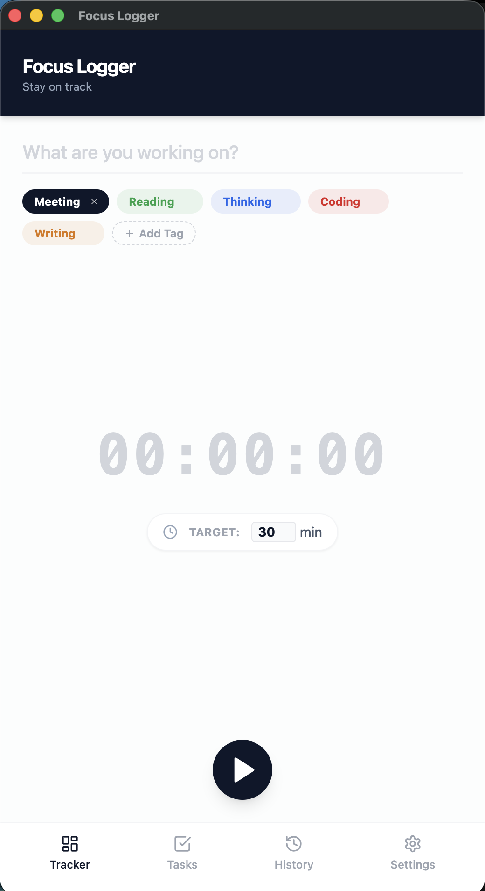
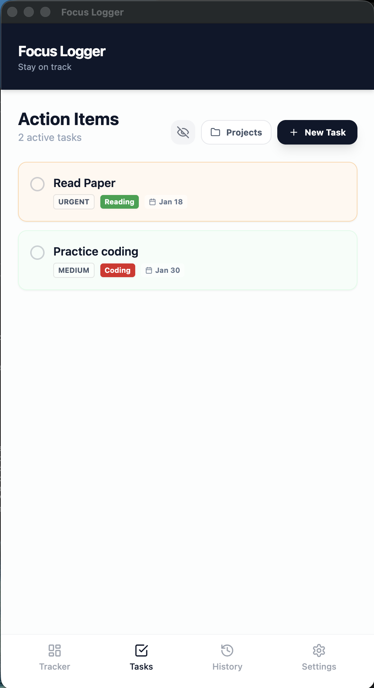
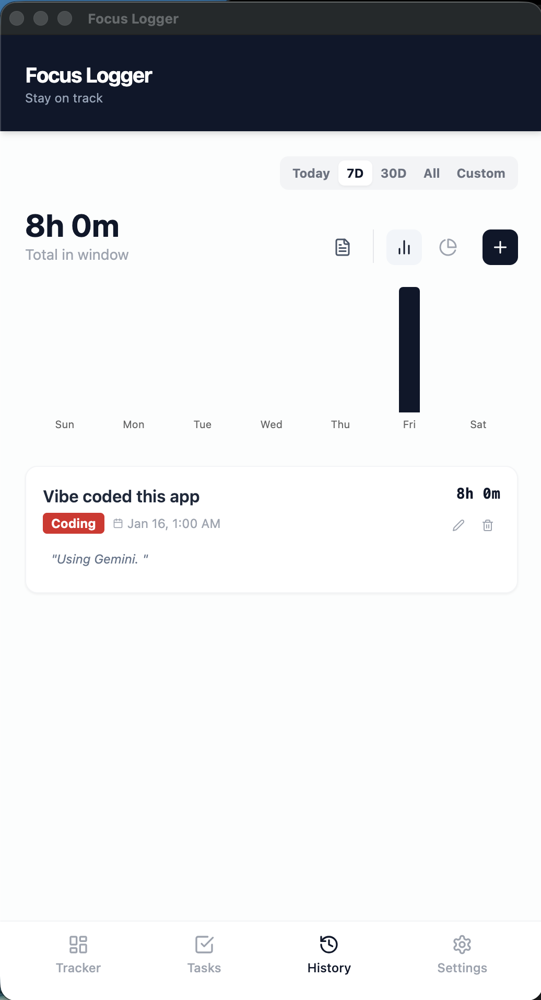
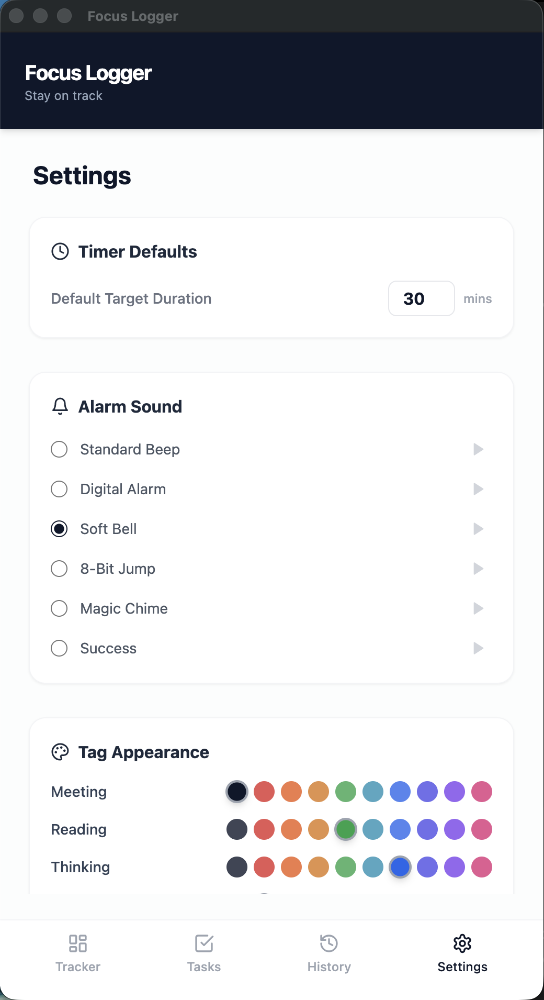

# Focus Logger 🎯


**A privacy-focused, offline productivity tracker built with React, Tailwind, and Electron.**

Focus Logger helps you manage your time with smart timers, deep work tagging, and local analytics. It was **vibe coded using Google Gemini** to ensure a seamless, modern development experience.

---

## 📸 Gallery

| **Tracking** | **Task Management** | **Analytics & History** | **Custom Settings** |
|:---:|:---:|:---:|:---:|
|  |  |  |  |

> **Note:** The images above are stored in the `public` directory of this repository.

---

## ✨ Features

- **⏱️ Smart Timer:** Custom target durations, auto-stop logic, and distinct audio alarms.
- **📝 Tasks & Projects:** Plan your day with Action Items and organize long-term goals with Projects (Complex Tasks).
- **🏷️ Tag System:** Color-coded tags for tracking different types of work (e.g., Deep Work, Meetings, Coding).
- **📊 Analytics:** Interactive visualizations (Histograms & Pie Charts) with filtering (Today, 7 Days, 30 Days, Custom Range).
- **📑 Reports:** Generate productivity summaries with daily averages and tag breakdowns.
- **🔒 Privacy First:** All data is stored locally on your device (`localStorage` / JSON). No cloud, no tracking.
- **🖥️ Cross-Platform:** Runs as a Web App or a Native Desktop App (Mac/Windows).

---

## 🚀 Quick Start

We have included a script to handle the setup for you.

1. **Clone the repo**
   ```bash
   git clone [https://github.com/mathrulestheworld/focus-logger.git](https://github.com/mathrulestheworld/focus-logger.git)
   cd focus-logger
   ```

2. **Make the script executable (One-time setup)**
   ```bash
   chmod +x easy-start.sh
   ```

3. **Run the Magic Script**
   ```bash
   ./easy-start.sh
   ```

4. **Choose your mode from the menu:**
   - **Option 1:** 🌐 **Run Web App** (Best for quick UI development).
   - **Option 2:** 🖥️ **Test Desktop App** (Runs inside an Electron window).
   - **Option 3:** 📦 **Build Mac App** (Generates a `.dmg` installer file).

---

## 🛠️ Manual Commands

If you prefer using standard npm commands without the helper script:

```bash
npm install          # Install dependencies
npm run dev          # Start web server (Browser mode)
npm run electron:dev # Run desktop version (Electron)
npm run dist         # Build the final executable (.dmg / .exe)
```

---

## 📂 Project Structure

- **`src/App.jsx`**: Main application logic (State, Audio Engine).
- **`src/components/Tracker.jsx`**: Timer UI, Goal input, Tag selection.
- **`src/components/Tasks.jsx`**: Task management (Kanban-lite), Project organization.
- **`src/components/History.jsx`**: Analytics, Charts, Reports, Logs.
- **`src/components/Settings.jsx`**: Config for defaults, sounds, colors.
- **`src/utils/storage.js`**: LocalStorage persistence logic.
- **`electron.js`**: Main process file for the Desktop App wrapper.

## 💾 Data Location

Your work logs are stored locally on your machine:
- **Mac:** `~/Library/Application Support/focus-logger/`
- **Windows:** `%APPDATA%/focus-logger/`

---

*This project was vibe coded with ❤️ and 🤖 Gemini.*